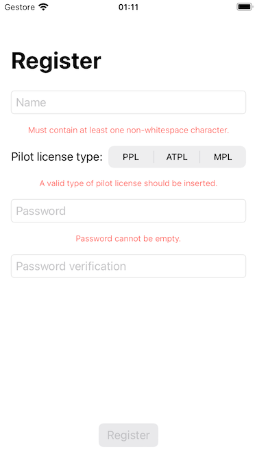
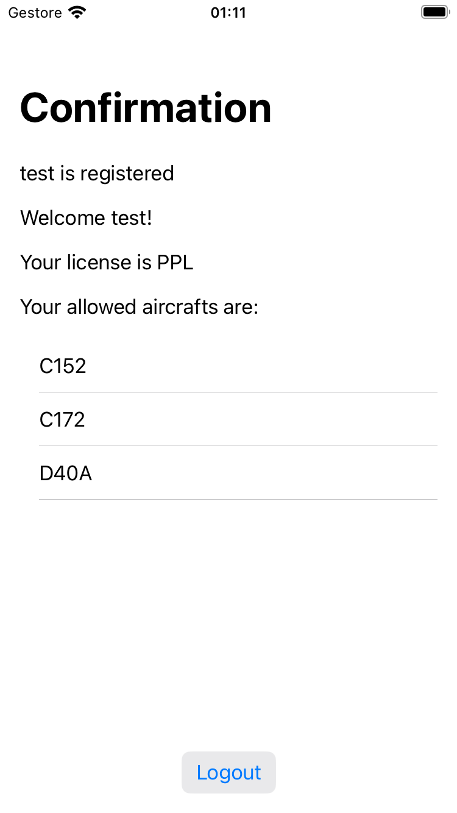

# Technical Assessment for iOS Software Engineers in Pilot Apps Team
The project "PilotApp" implements the requirements defined in the Technical Assessment task.
## Architecture
The app has been implemented following the MVVM pattern and the SOLID principles.
The development of the app was performed following a TDD approach adding functionalities in an incremental way.
## Key Classes
The main classes in the project can be separated in the following groups:
### Views:
- **ContentView**:
  Is the app entry point, it observes the **NavigationViewModel** to show the registration form or the confirmation page (or, eventually, a simple error screen.)

- **RegistrationView**: it is the form where the user put its name, license and password and where he can proceed to registration, its behavior is defined in the **RegistrationViewModel**
Below each field of the form an error message is showed if the field doesn't meet the requirements.


- **ConfirmationView**: it shows the user name, license and allowed aircrafts, a logout button allows the user to delete his data and go back to the form. Its viewmodel is **ConfirmationViewModel**


### View models:
- **NavigationViewModel**: this class detains the app navigation state that is defined in the enum:
```
enum Screen {
    case registration
    case confirmation(user: User)
    case error(error: Error)
}
```
This viewModel is set as an Observed object of the content view and is set as a weak reference in the other view models.
It was decided to use the weak reference instead of the environmentObject to keep the component more suitable to be tested, a minor drawback of this choice is that the reference has to be explicitly set when the viewmodel is instantiated.

- **RegistrationViewModel**: This class depends from RegistrationBusinessLogic that detains the component logic (validation, load, save data).
The class exposes the bindings to the registration view fields and the optional errors:
  ```
  @Published var name = ""
      @Published var nameError: Error?
      @Published var password = ""
      @Published var passwordError: Error?
      @Published var verificationPassword = ""
      @Published var verificationPasswordError: Error?
      @Published var selectedLicense: PilotLicense?
      @Published var licenses: [PilotLicense] = []
      @Published var licenseError: Error?
      @Published var applicationError: Error?
      @Published var isLoading = false
  ```
  The bindings triggers the validation functions and, if some of them fails, the related error is setted and showed in the view, for instance:
  ```
  private func validateName() {
          $name.map { [unowned self] aName in
              self.businessLogic.validateName(name: aName)
          }
          .sink(receiveValue: { result in
              switch result {
              case .failure(let error):
                  self.nameError = error
              case .success:
                  self.nameError = nil
              }
          })
          .store(in: &cancellables)
      }
  ```

  - The exposed functions are:
  ```
  func loadData() async
  ```
  - Loads the license data on view appear.
  ```
  func onRegister() throws
  ```
  - is called when the user taps the register button and saves the user in the app persistence through the businessLogic component and updates the navigation viewmodel
  ```
  var isRegisterButtonEnabled: Bool
  ```
  - returns the register button enabled state based on the presence of errors.

- **ConfirmationViewModel**: this simple class depends on the app persistance and exposes the bindings to populate the related view:
```
@Published var username: String
    @Published var allowedAircrafts: [String] = []
    @Published var license: String
```
The only exposed function is:
```
func onLogout()
```
That deletes the user from the app persistance and returns to registration screen.

### Business logics:
- **RegistrationBusinessLogic**: Implements the core logic of the registration screen and depends from LicenseRepository, FormValidator and persistance.
It implements the protocol **RegistrationBusinessLogicProtocol** that declares the following functions:
```
protocol RegistrationBusinessLogicProtocol {
    var licenses: [PilotLicense] { get }
    func loadLicenses() async throws
    func validateName(name: String) -> Result<Void, Error>
    func validateLicense(license: PilotLicense) -> Result<Void, Error>
    func validatePassword(username: String, password: String) -> Result<Void, Error>
    func saveUser(username: String, license: PilotLicense) throws -> User
}
```
For the validation functions, RegistrationBusinessLogic acts as a proxy for the FormValidator, the other core functionalities implemented are:
```
func loadLicenses() async throws
```
loads the pilot licenses asynchronusly from the LicenseRepository.
```
func saveUser(username: String, license: PilotLicense) throws -> User
```
saves the user in the persistence

- **FormValidator**: This class implements all the required validation logics required by the registration screen, such functions are declared int the protocol **FormValidatorProtocol** that this class implements:
```
protocol FormValidatorProtocol {
    func validateName(name: String) -> Result<Void, Error>
    func validateLicense(_ license: PilotLicense, in licenses: [PilotLicense]) -> Result<Void, Error>
    func validatePassword(username: String, password: String) -> Result<Void, Error>
}
```
All the functions return a Result object that can eventually contain the appropriate error detected:
  - **validateName**: uses a regex to check that the username is not only white spaces.
  - **validateLicense**: check if the selected license is included in the given array (that is passed from the businessLogic using the repository data).
  - **validatePassword**: check if the password respect the defined constraints and eventually return the appropriate error.

### Repository:
Has been defined a **LicensesRepository** protocol:
```
protocol LicensesRepository {
    func getLicenses() async throws -> [PilotLicense]
}
```
Such protocol has been implemented by the class **LocalLicensesRepository** that reads the licenses file from the app bundle.
The same protocol can be eventually implemented for loading the data from a remote url, hiding the implementation to the more abstract layers of the application.

### Persistence:
The **Persistable** protocol abstracts the persistence component of the application:
```
protocol Persistable {
    func saveValue<T: Encodable>(value: T, for key: String) throws
    func getValue<T: Decodable>(for key: String) throws -> T?
    func removeValue(for key: String)
}
```
The methods allows to save, retrieve and delete a generic object.
In the project it has been implemented by the class **UserDefaultsPersistance** that uses the UserDefaults to store the data.
For this case has been chosen this simple implementation, but it is possible to implement the same protocol using a database (eg. CoreData, Realm, etc.) hiding the implementation to the other layers.

The protocol **UserPersistance** is an utility protocol defined to avoid to use directly the Persistable generic methods and defines the methods needed to retrieve, save or delete the user:
```
protocol UserPersistance {
    func saveUser(user: User) throws
    func getUser() throws -> User
    func deleteUser()
}
```
It has been also implemented in the UserDefaultsPersistance, the other app layers depends only from this protocol.

## Testing strategy
### Unit tests:
The unit tests has been implemented following a TDD approach, so each component has his own defined tests:
  - **RegistrationViewModelTests**: here are defined all the integration tests for the registration view model, the dependencies has not been mocked in this case as it is an integration test to assert the functionalities of all the viewModel bindings and functions and all the possible error scenarios.
  - **ConfirmationViewModelTests**: this is the integration test for the confirmation viewModel and are defined the test to check the consistence of the registered user data and the logout functionality.
  - **RegistrationBusinessLogicTests**: here has been tested the loadLicenses and saveUser functionalities using mocked dependencies.
  - **FormValidatorTests**: here are defined the tests for the FormValidator functions and the specific error scenarios.
  - **LocalRepositoryTests**: tests the loadLicenses function

### UI tests:
Has been defined a set of ui tests to test the complete application "success flow" and the validation error scenarios.

Note: for a know issue on iOS simulator (https://stackoverflow.com/questions/55378639/strong-password-autofill-appears-in-ios-simulator_) please disable the automatic password insertions from the simulator password settings to run correctly the UI tests.

The total test coverage of unit and ui test is 95%.
