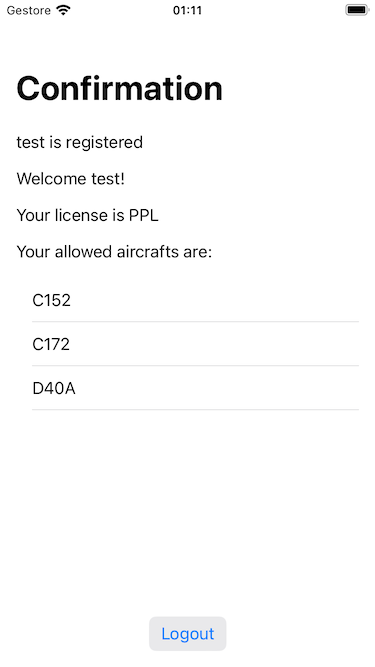

# Technical Assessment for iOS Software Engineers in Pilot Apps Team
The project "PilotApp" implements the requirements defined in the Technical Assessment task.
## Architecture
The app has been implemented following the MVVM pattern and the SOLID principles.
The development of the app was performed following a TDD approach adding functionalities in an incremental way.
## Key Classes
The main classes in the project can be separated in the following groups:
### Views:
- **ContentView**:
  Is the app entry point, it observes the **NavigationViewModel** to show the registration form or the confirmation page (or, eventually, a simple error screen.)

- **RegistrationView**: it is the form where the user put its name, license and password and where he can proceed to registration, its behavior is defined in the **RegistrationViewModel**
Below each field of the form an error message is shown if the field doesn't meet the requirements.


- **ConfirmationView**: it shows the user name, license and allowed aircrafts, a logout button allows the user to delete his data and go back to the form. Its viewmodel is **ConfirmationViewModel**


### View models:
- **NavigationViewModel**: this class detains the app navigation state that is defined in the enum:
```
enum Screen {
    case registration
    case confirmation(user: User)
    case error(error: Error)
}
```
This viewModel is set as an Observed object of the content view and is set as a weak reference in the other view models.
It was decided to use the weak reference instead of the environmentObject to keep the component more suitable to be tested, the drawback of this choice is that the reference has to be manually set when the viewmodel is instantiated.

- **RegistrationViewModel**: This class depends from RegistrationBusinessLogic that detains the component logic (validation, load, save data).
The class exposes the bindings to the registration view fields and the optional errors:
```
@Published var name = ""
    @Published var nameError: Error?
    @Published var password = ""
    @Published var passwordError: Error?
    @Published var verificationPassword = ""
    @Published var verificationPasswordError: Error?
    @Published var selectedLicense: PilotLicense?
    @Published var licenses: [PilotLicense] = []
    @Published var licenseError: Error?
    @Published var applicationError: Error?
    @Published var isLoading = false
```
The bindings triggers the validation functions and if some of them fails, the related error is setted, for instance:
```
private func validateName() {
        $name.map { [unowned self] aName in
            self.businessLogic.validateName(name: aName)
        }
        .sink(receiveValue: { result in
            switch result {
            case .failure(let error):
                self.nameError = error
            case .success:
                self.nameError = nil
            }
        })
        .store(in: &cancellables)
    }
```

- The exposed functions are:
```
func loadData() async
```
- Loads the license data on view appear.
```
func onRegister() throws
```
- is called when the user taps the register button and saves the user in the app persistence and updates the navigation viewmodel
```
var isRegisterButtonEnabled: Bool
```
- returns the register button enabled state based on the presence of errors.

- **ConfirmationViewModel**: this simple class depends on the app persistance and exposes the bindings to populate the related view:
```
@Published var username: String
    @Published var allowedAircrafts: [String] = []
    @Published var license: String
```
The only exposed function is:
```
func onLogout()
```
That deletes the user from the app persistance and returns to registration screen.
